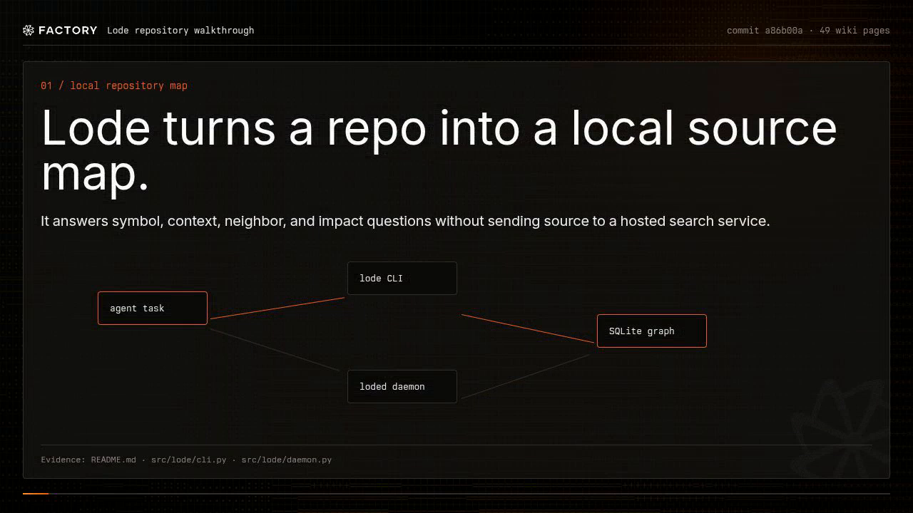

# Lode

Lode gives coding agents a local map of a repository.

It indexes source files into SQLite for fast lookups, and can project the same
facts into embedded Kuzu when you want graph traversal. The job is simple: answer
"where is this symbol?", "what should I read?", "what calls this?", and "what
might break if I touch it?" without sending the repo to a hosted code-search
service.

[](https://app.factory.ai/wiki/a71cbea2-853d-40f7-a479-f1e8d6af8252)

Watch the generated overview video in the
[Factory wiki](https://app.factory.ai/wiki/a71cbea2-853d-40f7-a479-f1e8d6af8252).

The generated docs are also mirrored to the GitHub wiki:
https://github.com/alfredosdpiii/lode/wiki

## Goals

- Local by default: no account, hosted index, or remote API call required.
- CLI first: agents can call `lode` directly and get bounded JSON with file:line citations.
- Fast path in SQLite: exact lookup and FTS stay cheap enough for per-turn use.
- Optional graph path in Kuzu: Cypher and vector experiments without leaving local disk.
- Daemon-friendly: run `loded` on login if you want a warm local service.

## Current state

This is an early MVP. Today it can:

- `lode index PATH` for Python, TypeScript/JavaScript, Markdown, and config-ish files.
- `lode search QUERY --json` over SQLite FTS5.
- `lode symbol NAME --json` for exact-ish symbol lookup.
- `lode context QUERY --json --budget N` for an agent context pack.
- `lode impact TARGET --json` for callers, callees, full reachable blast radius, and affected entrypoints.
- `lode neighbors NODE_ID --json` for direct graph neighbors.
- `loded` local HTTP daemon with `/health`, `/status`, `/index`, `/search`, and `/context`.
- Optional Kuzu projection code when the `kuzu` extra is installed.
- Docker Compose with a local TEI embeddings service using `Snowflake/snowflake-arctic-embed-s`.

## Install

The PyPI package is called `lode-kg`; it installs the `lode` CLI and `loded` daemon.

```bash
uv tool install lode-kg
lode --help
```

Or install with the optional embedded Kuzu projection support:

```bash
uv tool install 'lode-kg[kuzu]'
```

### Install the Pi skill

This repo also ships a Pi skill at `skills/lode/`. The skill is not the CLI; it
is the short instruction pack that tells Pi when to reach for `lode index`,
`lode search`, `lode symbol`, `lode context`, and `lode impact` during codebase
work.

Install it globally for your Pi user:

```bash
mkdir -p ~/.pi/agent/skills/lode
cp -R skills/lode/. ~/.pi/agent/skills/lode/
```

Or install it only for one project:

```bash
mkdir -p .agents/skills/lode
cp -R skills/lode/. .agents/skills/lode/
```

Then run `/reload` inside Pi, or restart Pi. You can force-load it with
`/skill:lode`; otherwise Pi should pick it up when a task calls for local repo
search, symbol lookup, impact checks, graph neighbors, or a bounded context pack.

Review `skills/lode/SKILL.md` before installing it from any checkout you do not
trust. Skills are instructions to your agent, not inert docs.

## Quick start

```bash
lode index ~/Projects/lode
lode search "knowledge graph" --json
lode context "how does indexing work" --json --budget 4000
```

Run the local daemon:

```bash
loded --host 127.0.0.1 --port 7979
```

Use Docker Compose:

```bash
docker compose up -d --build
curl http://127.0.0.1:7979/health
```

The `loded` container runs as `${LODE_UID:-1000}:${LODE_GID:-1000}` so the host
CLI can still write the SQLite file. If your user is not UID/GID 1000, export
`LODE_UID=$(id -u)` and `LODE_GID=$(id -g)` first.

Index a mounted repo through the daemon:

```bash
curl -sS -X POST http://127.0.0.1:7979/index \
  -H 'content-type: application/json' \
  -d '{"path":"/repos/lode"}' | jq
```

## Architecture

```text
agent / human
    |
  lode CLI
    |
localhost HTTP or direct DB
    |
  loded daemon
    |--------------------------|
    | scanner / parser         |
    | resolver                 |
    | context pack builder     |
    | embedding queue          |
    | Kuzu projector           |
    |--------------------------|
       |                   |
 SQLite hot index       Kuzu graph DB
       |                   |
       +---- fact projection ----+
               |
        TEI embeddings service
```

SQLite handles the lookups an agent needs during a turn. Kuzu is for graph and
Cypher work. Longer term, facts should be append-only and replayable so both
projections can be rebuilt from the same log.

## CLI commands

```bash
lode index PATH [--data-dir DIR] [--sync-kuzu]
lode status [--json]
lode search QUERY [--repo PATH] [--limit N] [--json]
lode symbol NAME [--repo PATH] [--limit N] [--json]
lode context QUERY [--repo PATH] [--budget N] [--json]
lode impact TARGET [--repo PATH] [--limit N] [--neighbor-limit N] [--depth N] [--max-nodes N] [--direction up|down|both] [--json]
lode neighbors NODE_ID [--json]
lode kuzu-sync
lode embed [--limit N] [--url URL] [--model MODEL] [--json]
lode serve --host 127.0.0.1 --port 7979
```

`kg` and `kgd` are temporary aliases for `lode` and `loded`.

## Storage layout

Default data directory:

```text
~/.local/share/lode/
  lode.sqlite
  lode.kuzu/
```

## Embeddings

Docker Compose starts Hugging Face Text Embeddings Inference with
`Snowflake/snowflake-arctic-embed-s`. It exposes `/embed` on `127.0.0.1:7980`
for local smoke tests and wires the daemon with
`LODE_EMBEDDINGS_URL=http://embeddings:80`. Embeddings are optional; exact search
and graph links should still carry the tool when no model is running.

Model choice: `snowflake-arctic-embed-s` is the strongest 33M-parameter /
384-dimension small English retrieval model in the comparison set I used, with
MTEB retrieval NDCG@10 of 51.98 versus 51.68 for `BAAI/bge-small-en-v1.5`. It
also has ONNX artifacts and passed a TEI CPU `/embed` smoke test.

Embed queued nodes after indexing:

```bash
docker compose up -d embeddings
LODE_EMBEDDINGS_URL=http://127.0.0.1:7980 \
  LODE_EMBEDDINGS_MODEL=Snowflake/snowflake-arctic-embed-s \
  uv run lode embed --limit 32 --json
```

`Qwen/Qwen3-Embedding-0.6B` was tested first, but it is a bad TEI CPU default
here: the container downloads the model, reports missing ONNX artifacts, falls
back to Candle CPU warmup, and restarts before `/embed` serves.
`BAAI/bge-small-en-v1.5` works. `Snowflake/snowflake-arctic-embed-s` is the
current small-model default because it is in the same size class and scored a bit
better in the benchmark data I checked.

## Benchmarks

Latest local run: 2026-05-31 on an AMD Ryzen 9 8945HS, 16 logical cores, Python
3.13.9. Raw artifacts are under ignored `bench-results/20260531T184011Z/`. The
numbers to watch are the SQLite hot-path timings; that is what an agent uses
inside a normal turn. Kuzu sync is a batch/analytics projection.

| Workload | Files | Nodes | Edges | Cold index | Hot re-index | Search p50 | Symbol p50 | Context p50 | Neighbor p50 | Kuzu sync | Embeddings |
|---|---:|---:|---:|---:|---:|---:|---:|---:|---:|---:|---:|
| Lode repo | 19 | 814 | 1,166 | 161.970 ms | 9.866 ms | 0.348 ms | 0.491 ms | 2.038 ms | 0.457 ms | 8,587.591 ms | 32 @ 24.3/s, 384d |
| Medium app | 383 | 4,817 | 4,573 | 2,505.509 ms | 43.303 ms | 1.742 ms | 4.187 ms | 6.717 ms | 1.162 ms | 41,702.766 ms | 32 @ 33.5/s, 384d |
| Larger app SQLite hot path | 1,270 | 15,846 | 15,453 | 17,342.433 ms | 95.348 ms | 14.359 ms | 15.739 ms | 34.076 ms | 3.437 ms | n/a | n/a |

For RepoBench-style retrieval, I ran all Python v1.1 cross-file rows from
[`tianyang/repobench_python_v1.1`](https://huggingface.co/datasets/tianyang/repobench_python_v1.1).
The run uses `context` mode, `--query-lines 5`, `--search-limit 30`,
`--context-budget 6000`, and reports retrieval only: did Lode rank the gold
cross-file snippet path high enough? It does not score code generation.

Raw artifacts are under ignored
`bench-results/20260531T203339Z-full-repobench-r/`. Fifteen rows were skipped
because `gold_snippet_index` pointed outside the provided context list.

| Split | Samples | Skipped | Mean retrieval | Hit@1 | Hit@3 | Hit@5 | Hit@10 | MRR |
|---|---:|---:|---:|---:|---:|---:|---:|---:|
| `cross_file_first` | 8,026 | 7 | 1.876 ms | 0.129828 | 0.373162 | 0.487914 | 0.565163 | 0.272828 |
| `cross_file_random` | 7,610 | 8 | 1.796 ms | 0.197766 | 0.428909 | 0.515769 | 0.572799 | 0.327461 |
| Combined | 15,636 | 15 | 1.837 ms | 0.162893 | 0.400294 | 0.501471 | 0.568879 | 0.299418 |

[RepoBench](https://openreview.net/forum?id=pPjZIOuQuF) is an ICLR 2024 benchmark
for repository-level code completion. I did not find an official v1.1
leaderboard. The closest public comparison is the original RepoBench-R paper
table, so the ranks below are a sanity check against older baselines.

| RepoBench-R slice | Lode rank vs paper baselines | What that means |
|---|---:|---|
| Hard `cross_file_random` | #2/6 on Hit@1 and Hit@3, #3/6 on Hit@5 | The strongest slice; only UniXcoder is clearly ahead on Hit@1/Hit@3. |
| Hard `cross_file_first` | #3/6 on Hit@1 and Hit@3, #4/6 on Hit@5 | Beats Random, CodeBERT, and Edit on the first two cutoffs. |
| Easy `cross_file_random` | #3/6 on Hit@1, #6/6 on Hit@3 | Finds the top file often enough, but loses recall by rank 3. |
| Easy `cross_file_first` | #6/6 on Hit@1 and Hit@3 | Weak spot. Jaccard, Edit, CodeBERT, Random, and UniXcoder all do better. |

Lode includes two benchmark entrypoints:

```bash
# Local operational benchmark: cold/hot index, search, symbols, context, graph, optional Kuzu
uv run python scripts/bench_lode.py --repo . --include-kuzu --json

# If TEI is running locally, include embedding throughput/persistence
docker compose up -d embeddings
uv run python scripts/bench_lode.py --repo . --embed-url http://127.0.0.1:7980 --json
```

For RepoBench-style retrieval quality, export a RepoBench split to JSONL and run the adapter:

```bash
# Expected fields match tianyang/repobench_python_v1.1: context, cropped_code, file_path, gold_snippet_index
uv run python benchmarks/repobench_adapter.py --input repobench_cross_file_first.jsonl --limit 100 --json
```

The adapter turns each sample into a tiny repository, then reports `hit_at_k` and
MRR for the gold cross-file snippet path. It is a retrieval benchmark, not a
code-generation benchmark.

## License

Apache-2.0.
